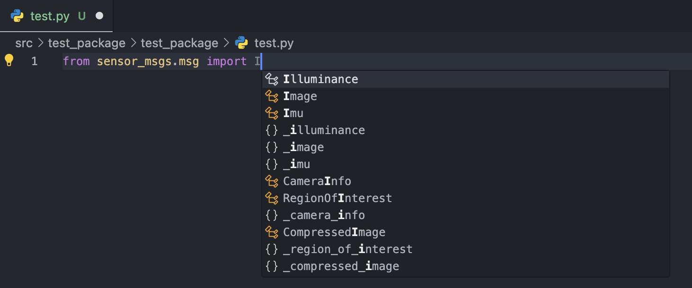
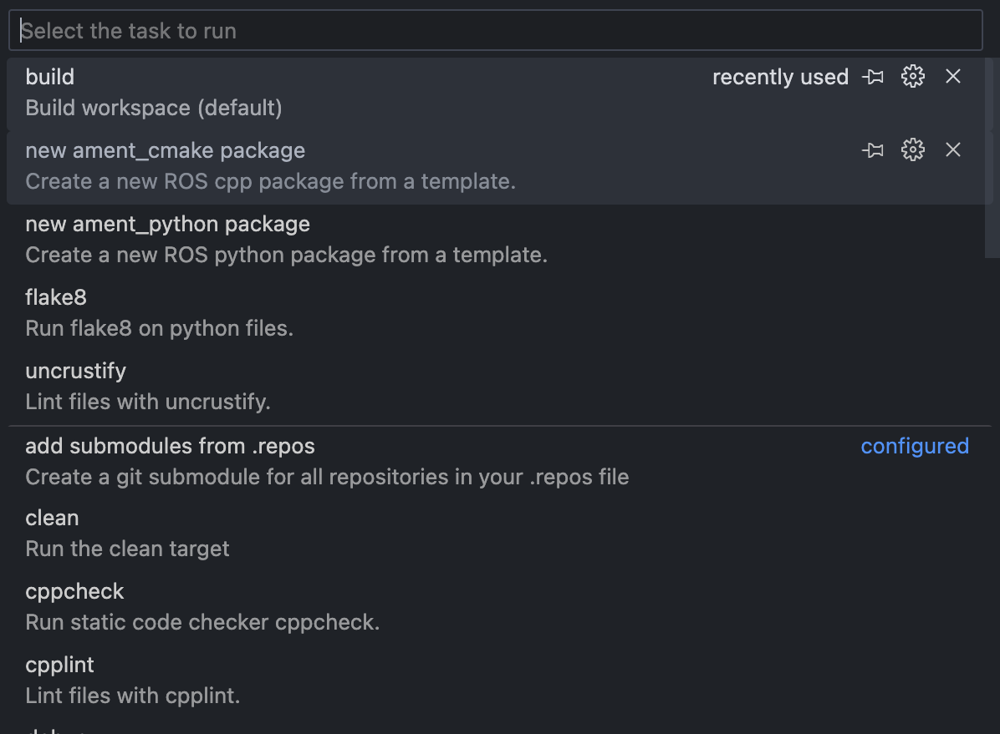
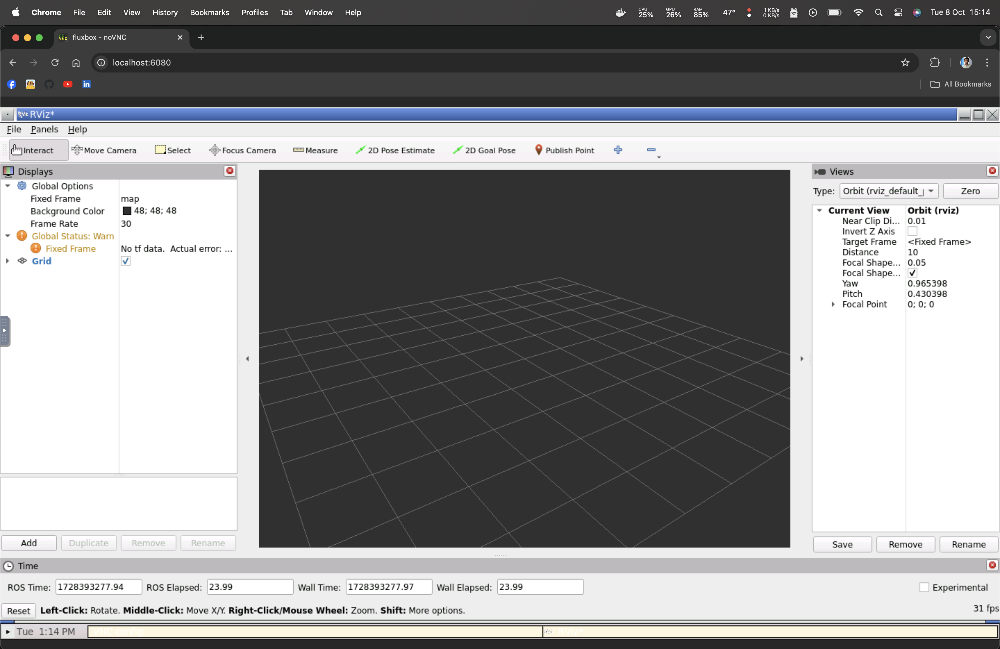
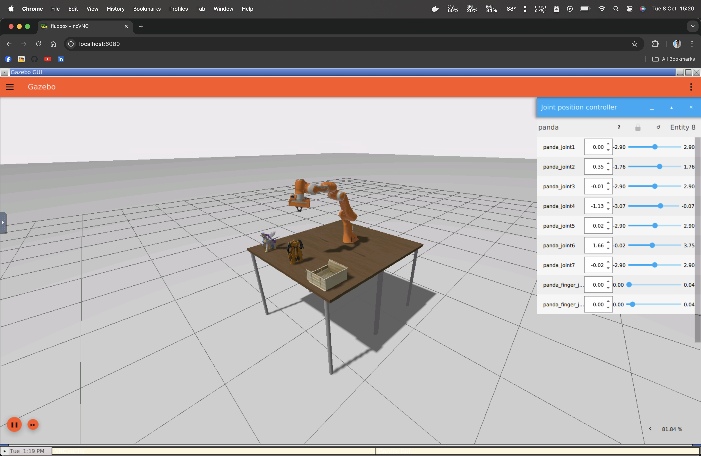

# 🚀 ROS2 Dev Container Template

This repository is designed to help you quickly create and manage ROS2 workspaces using **Dev Containers** and **Docker**. Whether you're on **Linux, MacOS, or Windows,** this setup ensures a consistent and hassle-free development environment. 

## ✨ Features

- **Cross-Platform GUI Support**: The GUI is handled through a built-in noVNC server, allowing you to access graphical applications directly from your browser making it OS agnostic.
- **Dev Container Ready**: Pre-configured for easy integration with VSCode by providing linting support and intellisense for Python 🐍 and C++ 🔧 (ROS2).
- **Automated VSCode Tasks**: Build, test, install dependencies, etc through pre-configured VSCode tasks.

## 🛠️ Prerequisites

Make sure you have the following tools installed on your system:
- [Docker](https://www.docker.com/) 🐳
- [Visual Studio Code](https://code.visualstudio.com/) 💻
- [Remote - Containers Extension](https://marketplace.visualstudio.com/items?itemName=ms-vscode-remote.remote-containers) for VSCode

## 🚀 How to Use This Template

### 1️⃣ Creating Your Own Repository

You can easily create a new repository using this template:

- Click the **"Use this template"** button at the top of this repository.
- Name your new repository.
- Clone your new repository locally.

### 2️⃣ Open in Dev Container

After creating your repository:

1. Open the repository folder in VSCode.
2. VSCode will prompt you to **"Reopen in Container"**. Click this option. If it doesn’t, open the command palette (`Ctrl+Shift+P` or `Cmd+Shift+P`) and run: `Remote-Containers: Reopen in Container`.
3. VSCode will automatically build the container and set up your development environment with linting support and intellisense.

### 3️⃣ Running VSCode Tasks

The workspace contains preconfigured tasks:

- **Build Package**: Build the selected ROS2 package.
- **Create Package**: Initialize a new ROS2 package.
- **Test Package**: Run unit tests for the package.
- **Install Dependencies**: Automatically install dependencies listed in `package.xml`.
- Etc

You can run these tasks by:
1. Opening the command palette (`Ctrl+Shift+P` or `Cmd+Shift+P`).
2. Searching for `Tasks: Run Task`.
3. Selecting the task you want to execute.

### 4️⃣ GUI Access through noVNC

To access GUI applications like RViz or Gazebo:

1. Ensure the container is running.
2. Open your browser and navigate to [http://localhost:6080](http://localhost:6080).
3. You will see the ROS2 GUI through noVNC!

### 🚧 Work in Progress

- [ ] Simplified debugging using GDB.
- [ ] Automated testing with GitHub Actions.
- [ ] Support for multi-architecture builds (ARM, x86) in Docker.
- [ ] Documentation generation from code comments.
- [ ] Enhanced logging and monitoring capabilities for ROS2 nodes.

## ☎️ Contact
Kousheek Chakraborty - kousheekc@gmail.com

Project Link: [https://github.com/kousheekc/ros2_devcontainer_template.git](https://github.com/kousheekc/ros2_devcontainer_template.git)

Hope this template saves you time and makes your ROS2 development more efficient. Feel free to reach out if you notice issues. Happy coding! 🚀

